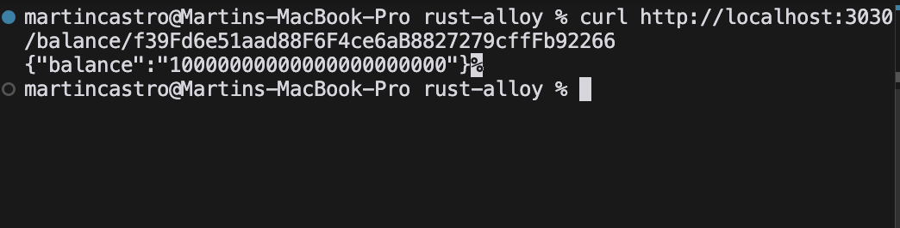
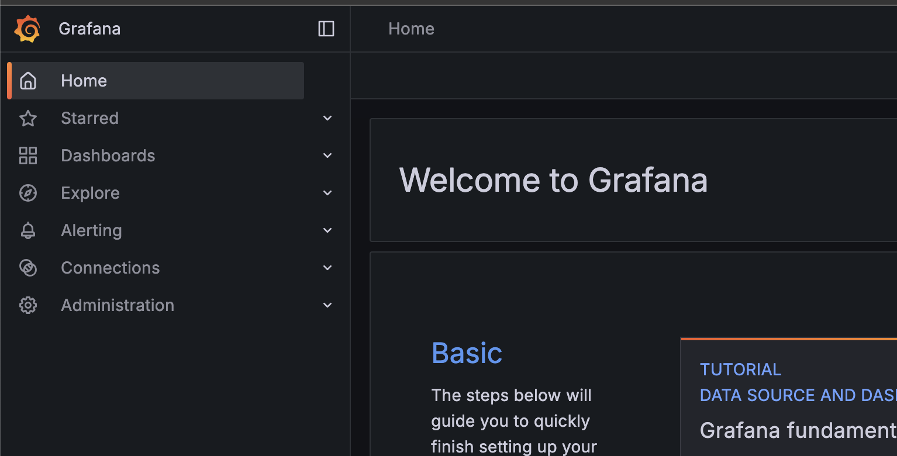

# rust-alloy

Dockerized Rust API using Tokio, Warp, Alloy, Foundry, and Grafana.


## References

- [Alloy](https://github.com/alloy-rs) - Rust Ethereum development framework
- [Anvil](https://book.getfoundry.sh/anvil/) - Local Ethereum node for development and testing

## API Documentation

| Endpoint | Method | Description |
|----------|--------|-------------|
| `/health` | GET | Check if the server is running. |
| `/balance/:id/balance` | GET | Get the balance of an address. |

## Setup

Start all the services using Docker Compose:

```bash
docker compose up -d
```

This will start a local Ethereum network using Anvil, the Rust API server, and Grafana.

Now, verify that the API is running:

```bash
curl http://localhost:3030/health
```


Next, you can get the balance of an address:

```bash
curl http://localhost:3030/balance/f39Fd6e51aad88F6F4ce6aB8827279cffFb92266
```



Also, verify that Grafana is running:

```bash
open http://localhost:3000
```



## Build

#### Linting & Formatting

Linting and formatting are handled by the `clippy` and `rustfmt` tools during the build process.
There is no need to run them separately.

#### Unit Testing

Unit testing is handled by the `cargo test` command.
This is run automatically during the build process. There is no need to run it separately.

```bash
docker compose up --build
```

## Deployment

Simple build the project according to [BUILD.md](./BUILD.md) and then deploy the API to a server.

Remember to set the `ETHEREUM_RPC_URL` environment variable to the URL of the Ethereum node you want to use.
In addition, set the `OTEL_EXPORTER_OTLP_ENDPOINT` environment variable to the URL of the OpenTelemetry collector you want to use.

## Monitoring

The project uses [Prometheus](https://prometheus.io/) to collect metrics and [Grafana](https://grafana.com/) to visualize them.

Prometheus is configured to scrape metrics from the project's API.

Grafana is configured to display the metrics collected by Prometheus.

To view the dashboards, run `docker compose up` and navigate to [`http://localhost:3000`](http://localhost:3000).

| File | Purpose |
|------|---------|
| [`otel-collector-config.yaml`](./infra/otel-collector-config.yaml) | Sets up how our monitoring system collects and sends data about our API. |
| [`prometheus.yml`](./infra/prometheus.yml) | Tells Prometheus (our metrics database) where to find the data it needs to store. |
| [`grafana/datasources/prometheus.yml`](./infra/grafana/datasources/prometheus.yml) | Helps Grafana (our metrics dashboard) find and display the data from Prometheus. |
